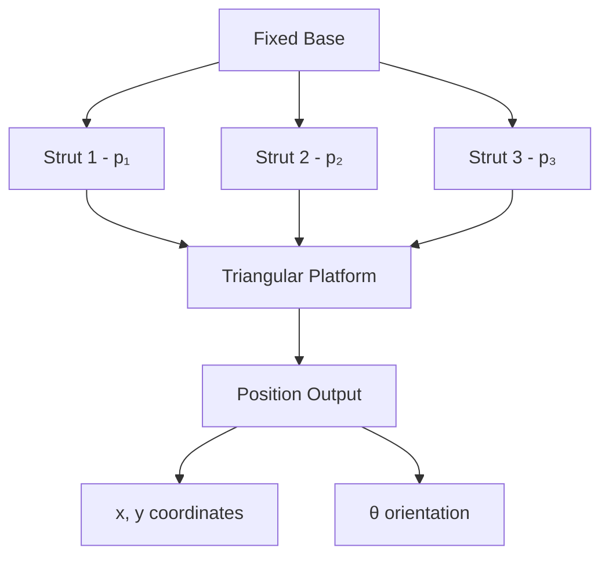
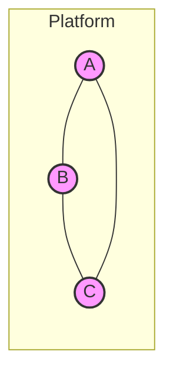
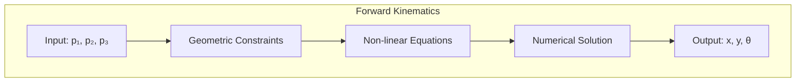
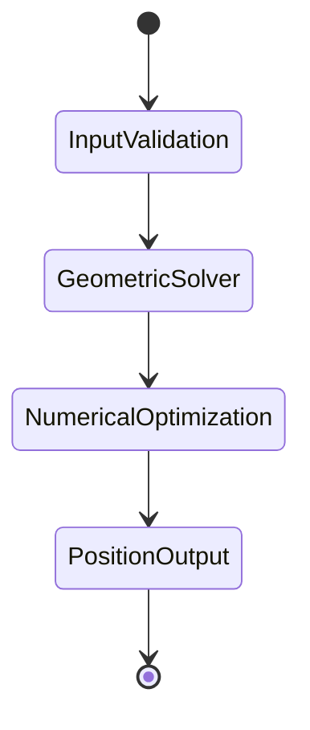

# Forward-Kinematics-of-Stewart-Platform
Solving Forward Kinematics Problem of Stewart Platform. 
A Stewart platform consists of six variable length struts, or prismatic joints, supporting a payload. Prismatic joints operate by changing the length of the strut, usually pneumatically or hydraulically. As a six-degree-of-freedom robot, the Stewart platform can be placed at any point and inclination in three- dimensional space that is within its reach.
Stewart platforms are known by various other names. In many applications, including in flight simulators, it is commonly referred to as a motion base. It is sometimes called a six-axis platform or 6-DoF platform because of its possible motions and, because the motions are produced by a combination of movements of multiple actuators, it may be referred to as a synergistic motion platform, due to the synergy (mutual interaction) between the way that the actuators are programmed. Because the device has six actuators, it is often called a hexapod (six legs) in common usage.
Project Problem Statement
To simplify matters, the project concerns a two-dimensional version of the Stewart platform. It will model a manipulator composed of a triangular platform in a fixed plane controlled by three struts.
the planar Stewart platform whose dimensions are defined by the three lengths L1, L2, and L3. Let γ denote the angle across from side L1. The position of the platform is controlled by the three numbers p1, p2, and p3, the variable lengths of the three struts.
Finding the position of the platform, given the three strut lengths, is called the forward, or direct, kinematics problem for this manipulator. Namely, the problem is to compute (x, y) and θ for each given p1, p2, p3. Since there are three degrees of freedom, it is natural to expect three numbers to specify the position. For motion planning, it is important to solve this problem as fast as possible, often in real time.

# 2D Stewart Platform Forward Kinematics Solver

This project implements a solution for the Forward Kinematics Problem of a simplified 2D Stewart Platform, providing real-time position computation for motion planning and control.

## Table of Contents
- [Overview](#overview)
- [System Architecture](#system-architecture)
- [Mathematical Model](#mathematical-model)
- [Implementation](#implementation)
- [Usage](#usage)
- [Contributing](#contributing)

## Overview

A Stewart Platform is a parallel manipulator featuring variable-length actuators supporting a movable platform. Our implementation focuses on a simplified 2D version with three degrees of freedom.

### Key Features
- Real-time position computation
- Three degrees of freedom (x, y, θ)
- Triangular platform configuration
- Variable strut length control

## System Architecture

The 2D Stewart Platform consists of these primary components:

### Platform Geometry

The triangular platform is defined by:

Where:
- L₁, L₂, L₃: Side lengths of the triangle
- γ: Angle opposite to L₁
- p₁, p₂, p₃: Variable strut lengths

## Mathematical Model

The forward kinematics problem involves calculating the platform position (x, y, θ) given strut lengths p₁, p₂, p₃.

### Key Equations

The system is governed by these geometric constraints:
1. Distance equations for each strut
2. Triangle geometry preservation
3. Orientation constraints

## Implementation

The solver uses these components:

