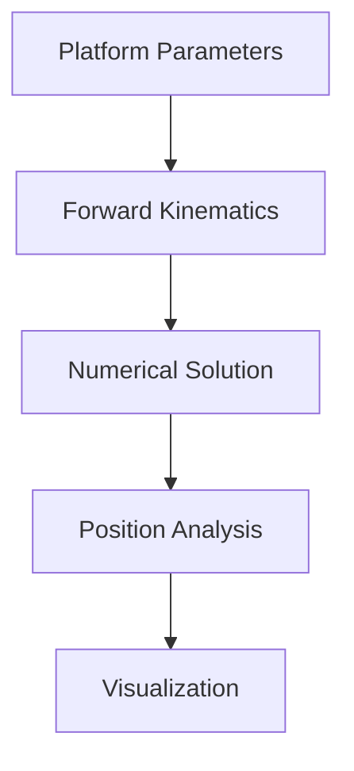
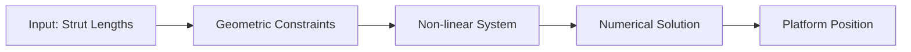

# 2D Stewart Platform Forward Kinematics Analysis

## Overview
This project implements numerical solutions for the forward kinematics problem of a simplified 2D Stewart Platform. The code analyzes platform positions, computes strut configurations, and visualizes platform poses.



## Features
- Forward kinematics solver for 2D Stewart Platform
- Multiple pose analysis and visualization
- Root-finding using Bisection Method
- Convergence rate analysis
- Parameter space exploration
- Interactive visualizations

## Mathematical Model

### Platform Parameters
- L1, L2, L3: Triangle side lengths
- γ: Angle opposite to L1
- p1, p2, p3: Variable strut lengths
- (x1, x2, y2): Fixed base coordinates

### Key Equations


## Implementation Details

### Core Functions
1. `stewart_theta(theta)`: Computes platform position for given angle
2. `forward_kinematics(theta)`: Implements forward kinematics equations
3. `bisection_method()`: Root-finding implementation
4. `convergence_analysis()`: Studies solution convergence

### Analysis Capabilities
1. Multiple pose identification
2. Parameter space exploration
3. Convergence rate calculation
4. Stability analysis

## Results & Analysis

### Key Findings
1. **Pose Variations**:
   - 2 poses at p2 = 4
   - 4 poses at p2 = 5
   - 6 poses at p2 = 7

2. **Convergence Analysis**:
   ```mermaid
   graph TD
       A[Initial Guess] --> B[Convergence Check]
       B --> |Converged| C[Solution Found]
       B --> |Not Converged| D[Update Guess]
       D --> B
   ```

### Parameter Space
Different p2 values yield varying numbers of valid poses:
- p2 < 3: No valid poses
- 3 ≤ p2 ≤ 4: Two poses
- 4 < p2 ≤ 6: Four poses
- 6 < p2 ≤ 8: Six poses

# Forward-Kinematics-of-Stewart-Platform
Solving Forward Kinematics Problem of Stewart Platform. 
A Stewart platform consists of six variable length struts, or prismatic joints, supporting a payload. Prismatic joints operate by changing the length of the strut, usually pneumatically or hydraulically. As a six-degree-of-freedom robot, the Stewart platform can be placed at any point and inclination in three- dimensional space that is within its reach.
Stewart platforms are known by various other names. In many applications, including in flight simulators, it is commonly referred to as a motion base. It is sometimes called a six-axis platform or 6-DoF platform because of its possible motions and, because the motions are produced by a combination of movements of multiple actuators, it may be referred to as a synergistic motion platform, due to the synergy (mutual interaction) between the way that the actuators are programmed. Because the device has six actuators, it is often called a hexapod (six legs) in common usage.
Project Problem Statement
To simplify matters, the project concerns a two-dimensional version of the Stewart platform. It will model a manipulator composed of a triangular platform in a fixed plane controlled by three struts.
the planar Stewart platform whose dimensions are defined by the three lengths L1, L2, and L3. Let γ denote the angle across from side L1. The position of the platform is controlled by the three numbers p1, p2, and p3, the variable lengths of the three struts.
Finding the position of the platform, given the three strut lengths, is called the forward, or direct, kinematics problem for this manipulator. Namely, the problem is to compute (x, y) and θ for each given p1, p2, p3. Since there are three degrees of freedom, it is natural to expect three numbers to specify the position. For motion planning, it is important to solve this problem as fast as possible, often in real time.

